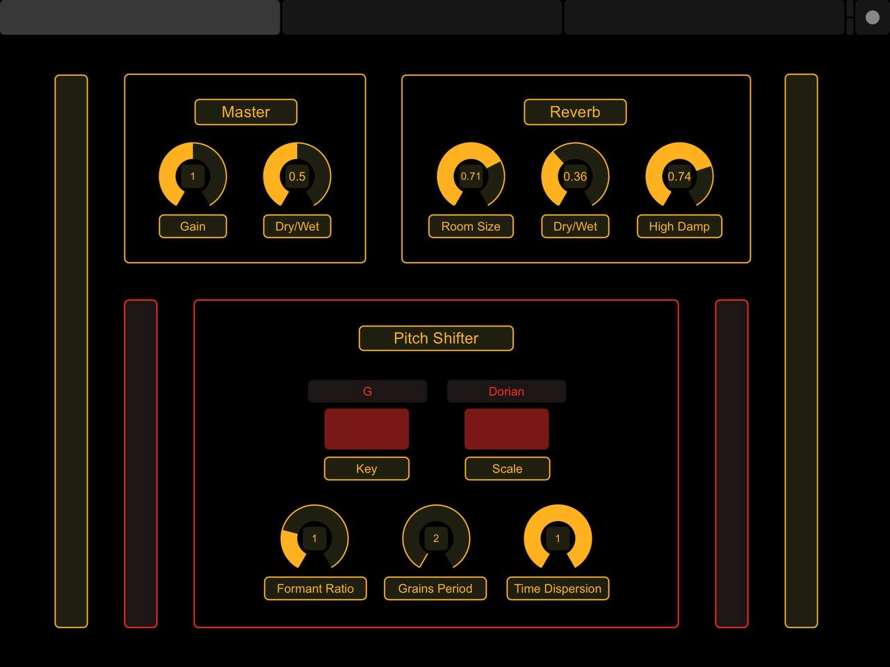

# Padder
**Padder** is a musical instrument based on a virtual pedal that, thanks to the interaction between the different blocks of its architecture, can generate chords that can be played in real time during a musical performance. This kind of approach could be seen as a handsfree way to generate chords, instead of using a piano or a keyboard. For example, it is possible to play the chords with the foot, while you’re playing the guitar and singing at the same time. 
Thanks to the small dimensions of the Arduino board and the sensors, it’s also a more portable instrument than a keyboard or a piano. Moreover, changing the synthesizer parameters, the musician can also create complex and very interesting pad-like sounds.

**Padder** architecture consists of 5 different blocks:
- A hardware part composed by an **Arduino Uno board** and two **URM09 Analog Ultrasonic Sensors** connected to it. These two sensors give the information about the note played depending on the distance of the foot from these two sensors. This information is fed to the synth.
- A pad-like synthesizer implemented using **wavetable synthesis**, provided with high-pass and low-pass filters and a Low Frequency Oscillator modulating output's amplitude.
- The updated version of our **HarMMMLonizer** takes the one-voice audio signal from the synth and creates different chords depending on the parameters of the harmonizer.
- The **Touch OSC** application (Mk1 version) that represents our Graphical User Interface of the synthesizer and of the smart harmonizer. Thanks to Touch OSC, it is possible to change the synthesizer and the harmonizer parameters in real time with a tablet, such as an iPad or other devices.
- The **visualization** part, whose goal is giving to the user a feedback of the chords played with the foot. The visualization was built in order to have different colors depending on the musical type of the played chord.

# GUI and Available Controls
The layout that was developed consists of three different pages. 

## General Controls
The first consists of two main sections: Master and Pitch Shifter. 

  

The Master section allows the musician to set master gain and dry/wet balance between input signal and pitched voices. Furthermore, some controls over reverberation effect to be accomplished on the final output are provided. Indeed, three knobs are available for Room Size, Dry Wet and High Damp parameters.
The Pitch Shifter section makes possible for the artist to set the key and the musical mode for pitch shifting. This controls elements consist of two buttons. By clicking on a button, the user can switch from the current value that is displayed within the corresponding label to next one. Moreover, three knobs are available, each one devoted to a specific parameter related to the pitch shifting. This section enables the musician to set Formant Ratio, Grains Period and Time Dispersion.
