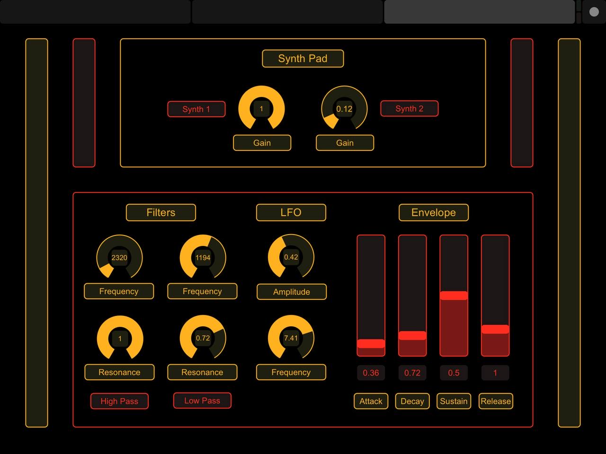

# Padder
**Padder** is a musical instrument based on a virtual pedal that, thanks to the interaction between the different blocks of its architecture, can generate chords that can be played in real time during a musical performance. This kind of approach could be seen as a handsfree way to generate chords, instead of using a piano or a keyboard. For example, it is possible to play the chords with the foot, while you’re playing the guitar and singing at the same time. 
Thanks to the small dimensions of the Arduino board and the sensors, it’s also a more portable instrument than a keyboard or a piano. Moreover, changing the synthesizer parameters, the musician can also create complex and very interesting pad-like sounds.

**Padder** architecture consists of 5 different blocks:
- A hardware part composed by an **Arduino Uno board** and two **URM09 Analog Ultrasonic Sensors** connected to it. These two sensors give the information about the note played depending on the distance of the foot from these two sensors. This information is fed to the synth.
- A pad-like synthesizer implemented using **wavetable synthesis**, provided with high-pass and low-pass filters and a Low Frequency Oscillator modulating output's amplitude.
- The updated version of our **HarMMMLonizer** takes the one-voice audio signal from the synth and creates different chords depending on the parameters of the harmonizer.
- The **Touch OSC** application (Mk1 version) that represents our Graphical User Interface of the synthesizer and of the smart harmonizer. Thanks to Touch OSC, it is possible to change the synthesizer and the harmonizer parameters in real time with a tablet, such as an iPad or other devices.
- The **visualization** part, whose goal is giving to the user a feedback of the chords played with the foot. The root note is displayed. Moreover, the visualization was built in order to have different colors depending on the musical type of the played chord.

  

## Guide to Usage
- First, connect the **Arduino UNO board**, then open up **arduino_URM09.ino** file with Arduino platform. Then press load button.
- Close **arduino_URM09.ino** file so that the serial port is available.
- Open and run in sequence **harmmmlonizer.sc** and **serial_port_reader.sc** files in SuperCollider. serial_port_reader.sc deals with mapping of signals coming from Arduino UNO board.
- Now, you need to share TouchOSC layout from your computer to your tablet device. You can easily do it via WI-FI network. Be sure that your computer and tablet device are connected to the same WI-FI network. Open **Padder.touchosc** file into **TouchOSC Editor** platform and press **Sync** button on the top bar. Then, open **TouchOSC Mk1** app on your tablet and click the button on top right of the screen. Now, click on the first option within **CONNECTIONS** section and set **IP Address** of your computer and **Port (outgoing)** SuperCollider is listening to (by default 57120). Get back to TouchOSC app general settings and enter **LAYOUT** section. Here, click on **add** button and, while Sync functionality is active, select your computer name (you can also add the IP Address). After that, select Padder layout and click **Done** on top right. Remember to set the correct **IP Address** and **Port (incoming)** of your tablet device within SuperCollider netAddr function for OSC communication between TouchOSC layout and HarMMMLonizer software. For further details, visit ([TouchOSC Mk1 official website](https://hexler.net/touchosc-mk1)).
- Open **lanscape_visual.pde** file into **Processing** platform and you're now ready to play with Padder.

## GUI and Available Controls
The layout that was developed consists of three different pages. 

### General Controls
The first page is composed of two main sections: **Master** and **Pitch Shifter**. 

  

The **Master** section allows the musician to set **Master gain** and **Dry/Wet** balance between input signal and pitched voices. Furthermore, some controls over **reverberation effect** to be accomplished on the final output are provided. Indeed, three knobs are available for **Room Size**, **Dry Wet** and **High Damp** parameters.
The **Pitch Shifter** section makes possible for the artist to set the **key** and the **musical mode** for pitch shifting. This controls elements consist of two buttons. By clicking on a button, the user can switch from the current value that is displayed within the corresponding label to next one. Moreover, three knobs are available, each one devoted to a specific parameter related to the pitch shifting. This section enables the musician to set **Formant Ratio**, **Grains Period** and **Time Dispersion**.

### Pitched Voices Controls
The **Pitched Voices** pages is divided into four sections, one for each voice, as four voices harmony is supported. 

  

For each section, **Gain** and **Pan** knobs make possible to set voice gain and panning values. **Voice Interval** slider allows to set the interval for pitch shifting, whereas the two buttons on its left side enable to set the **Number of Octaves** and **Direction for pitch shifting**, which can be accomplished within the same octave as the input note or one/two octaves upward/downward. 
Moreover, some controls over **Feedback Delay Line** are available. The musician can choose the desired Feedback Mode by clicking on the **FeedbackMode** button and set **DelayTime** and **Feedback Amount** values for feedback effect to be applied on the single pitched voice.

### Synth Pad Controls
The third page is devoted to **Synth Pad** controls and it consists of two sections.
As the synth pad sound is a mixture of two different sounds, the first section provides the musician with the possibility of controlling the balance between them. Indeed, two **Gain** knobs, one for each synth, are available.

  

The second section makes possible to control parameters related to **effects** and **ADSR envelope** to be applied on the synth sound. As a matter of fact, it consists of three subsections. The first one provides controls over **Frequency** and **Resonance** of the **High Pass** and **Low Pass filters**. Then, two knobs allows the musician to set **Amplitude** and **Frequency** of the **LFO**. Moreover, four sliders are available to control **Attack**, **Decay**, **Sustain** and **Release** of the **ADSR envelope**.

***You're now ready to play with Padder! Let's create some music!***
